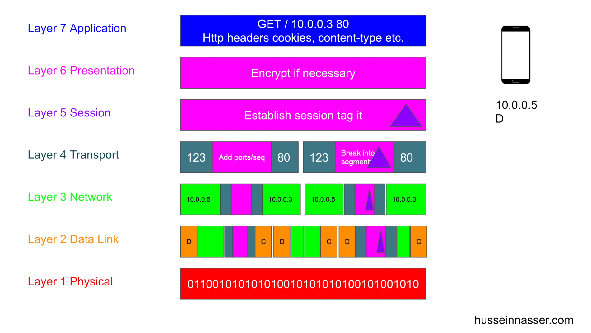
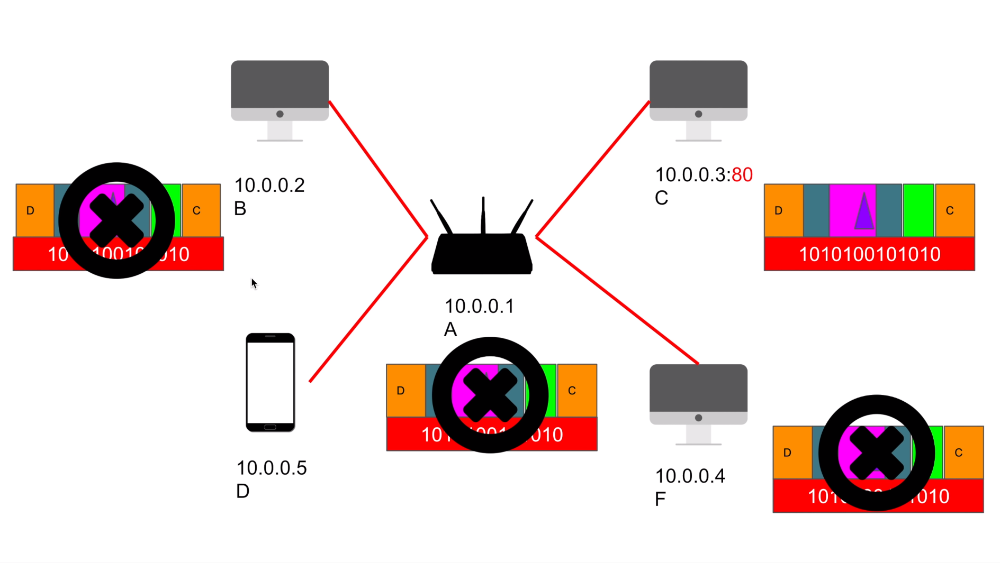
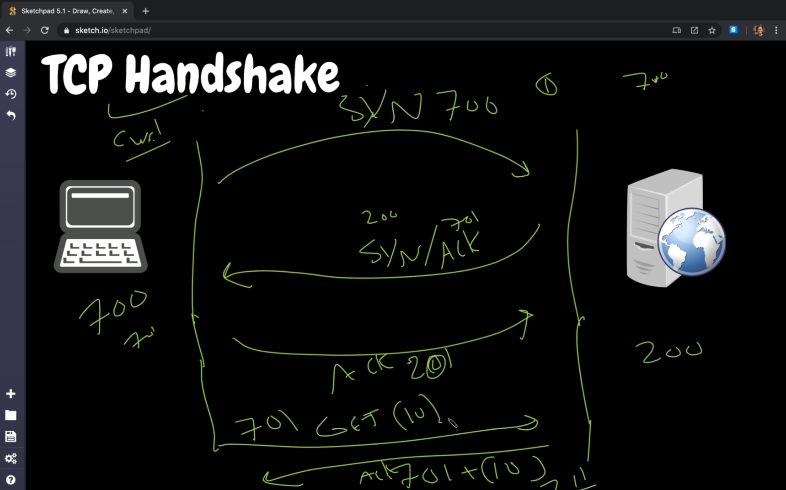

# Backend Engineering 
- Special thanks to Nasser Hussein [youtube](https://www.youtube.com/c/HusseinNasser-software-engineering/)
## OSI model
- For a local n/w when a request is sent on a browser to any device like 192.168.31.12:80
- The actual process for the get request is via OSI model
- steps
    1. Application Layer (the actual representation of data)
    2. Presentation layer (encryption of data)
    3. Session Layer (identifying sessions)
    4. Transport Layer (data is divided into segments with source & destination port mapping)
    5. Network layer (each segment can have multiple data packets with source & destination ips attached)
    6. Data link layer (Data packets can be further divided into smaller frames & mac address of both source & destination is alsl attached, ARP helps mappping)
    7. Physical Layer (bunch of 1's & 0's)
    
- Wifi router - router receives radio signals & it sends the data frames to all the devices in a multicast network (can be uni or multicast) , the Network card ina device identifies & accepts or rejects the data frames
- So it is not recommended to browse http websites on public internet, as anyone might reconfigure network card to accept all the traffic
    
- One can have 7 different tcp connections with webserver with diffreent sessions

> Later https://youtu.be/dh406O2v_1c


# HTTP
## HTTP Requests & Responses
- Req have 4 contents url, method type, headers, body
- Response have status code, headers, body

## Web Server & making requests to server
- one can simply create & spin up nodejs webserver using http-server library
- npm -g install http-server & http-server . => will run http server in current dir
- Browser first sends the request, server gives back a response text/html or image or any other stuff.
the referenced urls in response page are requested afterwards to accumulate all the data.
- One can also make a http request using simple javascript using fetch API
> fetch("localhost:8080").then(a=> a.text()).then(console.log)

## How it works
- Http works in layer 7 of OSI model, called as layer7 protocol.
- HTTP opens a tcp connection & closes the tcp connection after receiving data.
- tcp handshake is done first & data is sent & recieved

### HTTP 1(1996)
- creates a new tcp connection for each request,it is slow & buffering

### HTTP 1.1(survived for almost 20yrs, HTTP2 in 2015)
- invented keep-alive header,so connection is not closed until both parties wishes to close
- Persisted TCP connection, low latency, streaming & chunked transfer(image loading part by parts)
- Pipelining (disabled by default), all req are sent & client wait for response

### HTTP/2
- Compression, Multiplexing(multiple connections are sent in one tcp request)
- Server Push (Faster)
- SPDY
- secure by default
- Protocol Negotiation during TLS(NPN/ALPN) - client negotiates type of protocol with server (http1,2,etc) done in tls handshake
- Next protocol negotiation, replaced by Application layer protocol negotiation

### HTTP/2 over QUIC (HTTP/3)
- 2018 sept adoped by internet engg task force
- replaces with TCP with QUIC (UDP with congestion control)
- all HTTP/2 features
- Still experimental

## HTTP Params & Query Strings
- Params or url params is an identifier which can be further used for other purposes userid in this case - https://localhost:3000/user/5896544
- Query strings or query params are the key value pairs - https://localhost:3000/user?userId=5896544

# Etags
- etags are assigned by server on first requests for caching
- etags are attached to each request and server identifies req with it, if data not modified old data is returned
- When a first request is sent, response headers contain ETag, which is provided by server, corrresponding requests are sent with request header If-None-Match with value of ETag
- etag logic is created on webserver, can be hash of last modified data for a file, then it is compared with requests etag
- etags can also be used to monitor user actions, by pausing new creation of etags

# Zombie Cookies
- a cokies once deleted, can also be re created mainly used for tracking
- cookie even works in incognito mode, even it is created on normal browsing.
- can be done using multiple ways, for eg. e-tags 


# TCP AND UDP
## TCP
- TCP protocol is stateful protocol starts first with a 3-way handshake
- when Client sends http get request, SYN (sequence number for packet) is sent to the server, server acknowledges ACK & send back its SYN (sequence number would be 32bit random integer), the client then sends ACK, the 3-way handshake is done & connection is established
- Server now sends data to the get request, when client acknowledges it, the TCP connection is closed
    
- creating a tcp server using nodejs
    ```js
    const net = require("net")

    const server = net.createServer(socket => {
        socket.write("Hello.")
        socket.on("data", data => {
            console.log(data.toString())
        })
    })

    server.listen(8080)
    ```
- HTTP/2 does multiplexing by combining multiple requests into streams in a single tcp connection(multiprocessing in single tcp conn)

## UDP
- UDP protocol is a stateless protocol, when a client requests some information, data is sent to the client and the server does not wait for acknowledgement.
- Connectionless, No guranteed delivery, adds CRC checksum to the packet to check it is bad or good for rejecting it.
- No congestion control (it sends data, doesn't care if there's traffic)
- No ordering of packet, no sequence numbers, no headers
- Security concerns since its conncetion less and keeps sending data whoever asks for it (lot of firewalls disables UDP for this reason)
- Pros like smaller packets(no headers), hence consumes less bandwidth and faster
- sample code
    ```js
    const dgram = require('dgram');
    const socket = dgram.createSocket('udp4');

    socket.on('message', (msg, rinfo) => {
    console.log(`server got: ${msg} from ${rinfo.address}:${rinfo.port}`);
    });

    socket.bind(8081);

    ```

## TCP Slow start
- slow start is implemented in TCP to avoid congestion
- sometimes the server is capable of handling multiple requests & but the network which is transferring the data might not be that much capable
- So TCP slow start is a mechanishm where the window of sending recieving data is minimun at start & increases gradually as we receive data & if any issues in acknowledgements or erros
client will start reducing the congestion window where it can communicate efficiently with server

## TCP fast open cnnection
- if bot client & server support fast open connection, client sends fast open connection along with syn
- server sends the fast open cookie(Cryptographic hash) along with SYN/ACK
- useful in http 1.1, not kuch useful in http/2
- next time the client sends the requests, it will send syn along with fast open cookie& get request
- server acknowledges the SYN and also send the data along with SYN
- supported by curl

- HTTP/2 we can multiplex many requests in single tcp connection, but jn HTTP 1.1 we send tcp conn for each request
- slow start is congestion control(eager loading) & lazy loading(tcp fast open)

## TCP half open connection
- so in hlaf open connection, client will not response to SYN/ACK by server
- server tries to resend & eventually closes the tcp connection
- can be used to chexk if the port is open

## SYN flood
- when a client opens a half open tcp connection, server waits for ACK & teies to resend the SYN/ACK
- so when source ip is spooofed & multiple requests are sent to server with different source ip's, the tcp networks flood & block the memory
- can also be a DDOS


# WebServers
- Serves Web content, using HTTP Protocol
- Static, Dynamic content
- Used to host web pages, blogs & build API's

## How WebServers work
- Takes a HTTP request & responds the data
- when a requests is sent form client, memory is reserved for that connection(TCP socket)
- TCP does the handshake, requests data from the server

## Blocking single threaded webserver
- web servers spin up another thread for each of the requests in a server memory & serves those requests
- Webserver have a configuration for max-threads(apache) or max-connections
- webservers (httpd(apache), IIS, lighttpd, tomcat, http-server)
- we can write own servers usning (nodejs, python tornado)

## Apache2 example
- $ sudo apt install apache2
- new folder & html file is created in var/www/html/index.html
- we can add our own code in this folder & serve clients

## creating a server using express
- npm install express
- ```javascript
    const app = require("express")()
    app.get('/', (req, res) => {
        res.send("Hello")
    })

    app.get('/home', (req, res) => {
        res.sendFile(`${__dirname}/index.html`)
    })

    app.listen(8080, () => console.log("Listening on 8080"))
    ```

# Encryption
- Symmetric examples AES (Rijndael), Twofish, Derpent, DES
- Asymmetric eg. RSA, Diffle Elman, ElGamal
- in TLS, Asymmetric & Symmetric both are used, when initiated server sends public key aka certificate & the client send the secret key using asymmetric approcah using certifi cate


# TLS (transport layer security)
- for vanilla http, normal tcp handshake is done & the requests is processed.
- for https,during the handshake secret key is exchanged between client & server(both agress)
- the secret key is used to encrypt the request data while transfer(layer 6 or 7)

## TLS 1.2 (uses RSA)
- Client sends first request(hello), with all the stuff(encrypt algorithms) it supports
- server sends the certificate, along with the algorithm
- client takes certificate & encrypts secret key using server's public key & sends back
- server decrypts the secret key & the connection is established. key negotiations also done in this step
- Actual requests & responses(fully encrypted) happen after the key exchange
- Slow & Secure, Insecure key exchange(openly sharing encrypted private key) over internet & server's private key is obtained then whole data can be decrypted

## Diffie Hellman
- 3 keys(2 private, 1 public), combining three will get symmetric key
- combining 1 public & 1 private is public, not easy to separate out

## TLS 1.3 (uses Diffie Hellman)
- CLient would have public & private key, client will send public key & combined(public + private) unbreakable because these all are orime number
- Server after receiving the info, it will separate out client's public & private key combines with its private key to form symmetric key (for communication)
- Server send combination of its private key & client's public key
- Client decrypts the info & combines his public, private key along with servers private key to form symmetric key
- Instead of 4 steps connection is established in 2 steps with key security
- https://blog.cloudflare.com/rfc-8446-aka-tls-1-3/


# NAT
- Network address translation is mapping an ip port to another ip port
- Genrally if you try to access anything the network request packet contains the source ip as private ip issued by router specific to the network.
- If we're accessing internet, the destination ip wpuld be public
    - In each request we send our request first to gateway(router), so the router acts as gateway for our network and internet. 
    - Whenever we send request to public ip, router changes the packet's source ip as router's public ip and uses NAT tables to maintain records
    - When the response comes back it looks over NAT table and changes destnation ip in packet to send it back to the client
    - Our router has the 1 public ip for entire network (reducing usage of ipv4's)
- if we use public ipv6, we don't need NAT because we can create trillion's of public ip's

## Port Forwarding & Load Balancing
- Port forwarding can be done using iptables (might need root acess to listen on port numbers below 1024). we can forward all the requests from 80 to 8080
- load balancing - creates a vip(virtual IP) in nat table and maps to the the actual servers IP

# Proxy And Reverese Proxy
- Benefits of Proxy are Caching, Anonymity, Logging, Block Sites, Microservices
- microservice in proxy can upscale the HTTP protocol version for better security
- Reverse procy client doesn't know the actual server it is requesting
- Caching, Load Balancing(layer 4, layer7), Ingress( filtering the content), Canary Deployment(HaProxy, Ngnix, Envoy)
- Microservices 

### Appliations
- Proxy & Reverse Proxy at same time is called Service Mesh or Side car proxy
- Proxy can be used instead of vpn(but vpn only see's domains, proxy can see everything(TLS termination proxy))
- can be http, https,socks(tcp level 4), tls termination proxies

# ACID Properties

## Atomicity
- If one query fails, txn must rollback

## Isolation
- keeping the non committed changes isolated or non isolated
### Read Phenomena (lack of isolation)
- Dirty reads (non committted)
- non repeatable reads (reads got different value, due to commit in between in same txn)
- Phantom reads (inserted a record & picked up that record too when using sum or range functions)
- (Lost Updates) (Overwritten by some other txn befor commit)

### Isolation Levels (levels to fix phenomenas)
- read uncommitted (any changes outside are visible to txn)
- read committed (each query sees only commiited stuff)
- repeatable read (each query reads updates commiitted at the beginning of txn)
- serializable (shared lock for data editing), slowest of all

## Consistency
### consistency in data
- Defined by user, referential integrity(foreign keys), atomicity & Isolation
### reading data
- horizontal scalability might lead to inconsistency
- both relational & NoSQl suffer from this
- but eventually would be consistent

## Durability
- Commiited transactions must be persisted in a durable non-volatile storage(redis not durable)
---
# Primary Key vs secondary queue
# Btree, Btree+
---
# PubSub
## Request Response Breaks
- Youtube upload -> video is uploaded, it is processed & sends req to compress service, then submitted to format service creates all video formats, The notification service notifies all the subscribers.
- compressed service might also send to copyright service
- Pros -> Elegant & simple, stateless(HTTP), scalable
- Cons -> bad for multiple receivers, high coupling, client/server need to be running, chaining, circuit breaking (finagle)

## Pub/Sub - publish/subscribe model (message broker, message queue, streaming)
- all the services are decoupled, all the services push to topics after their task is completed
- services will subscribe to the topics
- Pros-> Scale w/ multiple receivers, micro-services, loose coupling, works while clients not running
- Cons -> Message delivery issues (two generals problem), Complexity(sending & receiving reqs), network saturation & scaling
- kafka, redis, rabbti mq are examples of pubsub

# Sync/Async, Multithread, Multiprocess
- async submits the task to the system and provides a callback function, which would be called after the completion of task
- A process with multiple threads, multithreading is tough to handle since all the threads can access same resource may lead to resource sharing issues
- Thread safe is a practice where (no two threads access same resource)
- Multiprocessing is spinning process for each task with their unique memory and resources, intercommunicate between those process using sockets or centralized database

## NodeJs Single Threaded & Multithreaded
- nodejs uses uv lib(c library) for IO and CPU intensive operations
- when dns ip resolution happpens via node, it uses threads and uvlib, crypto lib also uses uvlib for multiple thread exectuion
- async uses event loop 
- below env varible can be used to bump thread pool number
    > process.env.UV_THREAD_POOL_SIZE=6 //default=4
- Networkin operations uses main thread(never uses thread pool)

# Database Indexing
- index is a datastructure built on top of table, acts like an index on book which would help to find the contents easily
- Btree and LSM tree are two examples of data structures used in indexing
- Every primary key has btree index by default
- Postgres gives detailsabout the query execution by using below keywords 
    ```sql 
    explain analyze select id from employees where id=2000
    ```
- caching also done in db, if the data is already in the query(in where condition) is called inline query
- postgres default does parallel sequential scan using multiple worker threads by default when there happens a full table scan.
- Creating index would take time as it would create btree bit map structure for all the rows
	```sql 
    create index employee_name on employees(name)
    ```
- Bitmap index scan is done when index is present in query output
- like statement avoids indexes, because expression is not a single value, it have to match the string and indexing is not for this

## Btree, Btree+
- when getting data with big databases when full table scan occures, we can use partitions, spearing data to multiple tables, indexing
- creating index may also lead to issues or delay while inserting data, because it would need to balance the tree.
- B-tree (Generalised binary tree, Blanaced tree)
- study [later](https://www.youtube.com/watch?v=aZjYr87r1b8)

### Btree
- max number of elements in a node is 1 less than maximum degree (if 3 is degree, 2 ele can be stored in node)
- Btree's structure is changed as per the inserts
- node is a page in db engine
- [visualization](https://www.cs.usfca.edu/~galles/visualization/BTree.html)

### B+ tree
- multiple elements can only be stored in leaf nodes in B+ tree
- traversing the range values is easy & cost efficient, since pointers are used to reference the value
- [visualization](https://www.cs.usfca.edu/~galles/visualization/BPlusTree.html)

