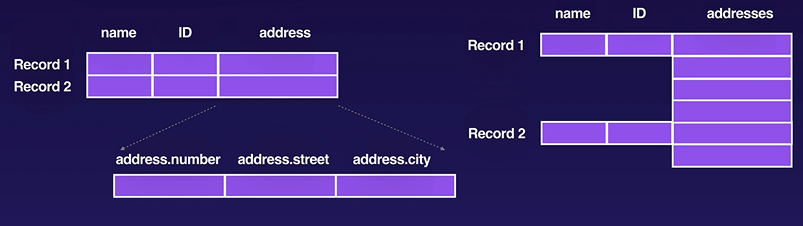

# Google Certified Data Engineer

- Builds manages infrastructure for handling data
- Builds Pipelines for ingesting the data
- Creates Systems for processing & analysing data
- Creates Frontends to visualize & present the data
- Trains Machine learning models
- Leverage Google Pre-built ML API's

# Big Data

Large chunks of data, 3V's defines Big Data
- Volume (Scale of INfo handled by data processing systems) 
    - MB's to PB's & ZB's
- Velocity (Speed at which data is being processed ingested, analysed and visualized)
    - Adhoc, Batched, Near Realtime, Realtime
- Variety (The Diversity of data sources, formats & quality)
    - Key/Value, Tabular Data, Images, Video, Audio, Unstructered, Streaming Data (Mobile & IOT)

Terms in BigData

1. Data Warehouse & Data lakes
2. OLTP & OLAP
3. SQL & NoSQL
4. Batch & Streaming

### Data Warehouse
- Structured or Processed Data
    - Organized, may have transformed & is stored in structed way
- Ready to Use Data
    - Data exists in the warehouse for a defined purpose, & in format where it is ready to be consumed
- Rigid
    - Data may be easier to understand, but less up-to-date & structures are hard t0 change

### Data Lake
- Raw and/or Unstructed Data
    - Data lake contains all raw, unprocessed data before any kind of transformation or organization
- Ready to Analyze
    - Data is more up-tp-date, but may require more advanced tools for analysis
- Flexible
    - No Structure is enforced, so new types of data can be added at any time.

### OLTP (Online Transaction Processing)
- High volume of short transactions
- Fast queries
- High Integrity

### OLAP (Online Analaytical Processing)
- Low volume of long running queries
- Aggregated Historical data
- ETL Processes take data from OLTP & Load into OLAP System

### SQL
- Relational Databases
- Structered Schema's

### NoSQL
- key values pairs data store
- json document store

### Batch
- Data gathered within a defined window of time
- large volumes of data
- data from legacy systems

### Streaming
- Continuous collection of data
- Near real time analytics
- windows & micor-batches
---
## Data Processing Pipelines
---
Fundamental part of data processing system
### Ingestion
- First stage of data processing, data loaded into data warehouses or data lakes
- can be batch loaded or streamed
- Archive data(historical data), log collection(logs from multiple systems), device data(real time mtrics from medical devices)
- HTTP or FTP ingestion (Networking & low cost, data security)

### Storage

### Processing
- ETL (Data ingestion), data is taken from source & manipulated to fit parameters of destination
- ETL sometimes replaced with ELT( Extract load transform), data is loaded into data lake & transformation takes place later
- Common transformation, Formating, Labeling, Filtering, Validating  

### Visualization
- Data Studio from GCP to get insights of data
- Recommendation system or machine learning models

---
# Data Storage in GCP


### Cloud Storage
- Unstructered object storage (buckets)
- regional, dual-region, multi-region
- Standard, nearline, coldline, archive
- Storage event triggers(can trigger notification(pubsub) when anything is added)

### Cloud BigTable
- Petabyte-scale NoSQL database
- High throughput & scalability
- Wide column key/value data(Single key multi values)
- Time-series, tramsactional, IOT data

### BigQuery
- Petabyte-scale analytics data warehouse
- Fast sql queries acorss large datasets
- Foundations for BI & AI
- Public datasets

### Cloud Spanner
- Global SQL base relational database
- Horizontal scalability & high availability
- Strong consistency
- FInancial transactions

### CLoud SQL
- managed MYSQL, SQL Server & postgresSQL instances
- Built-in backups, replicas & failover
- Vertically scalable 

### CLoud Firestore No SQL
- Fully managed no sql document database
- Large collections of small JSON documents
- Realtime database with mobile SDK's
- Strong consistency

### Cloud Memory Store
- Managed Redis instance
- In-memory DB, Cache or message broker
- Built-in high availability & Vertically Scalable

---
## Managing Data
Sources & Sinks, Structured & Unstructered data
Batched or Streaming data

### Data Modeling

1. Conceptual Stage - Entities, attributes & relationships among them

2. Logical Stage - What are structures of entities & Can model be normalized

3. Physical Stage - How to implement Database, what keys & indexes need to be created

For Relational Database
- Good Relational Schema design
- Normalization & Reducing waste
- Primary keys & table relationships
- Accuracy & Integrity

Non-Relational
- Simple key value (Redis)
- Flexible document store
- High Volume columnar Database

## Data Pipelines


---
# Storage
## Google Cloud Storage

- Fully managed Object Storage(unstructured data:Images,videos,etc access via HTTP API or SDKs)
- Multiple Storage Classes
- Secure & Durable

### GCS Bucket
- A bucket is logical container for objects
- Buckets exist within projects
- Bucket names exist within global namespace
- Regional (default), Dual Regional, Multi Regional
- Can assign Default class to Bucket & separate for objects
- Standard, Nearline, Coldline, Archive

#### Objects in GCS Bucket
- Objects are stored as opaque data (0's and 1's & encrypted)
- Immutable (no updates)
- Overwrite is atomic (object persist until new one is uploaded)
- Versioning (make Previous version available)
- can be accessed using gcloud console, HTTP API, SDk's or gsutil command line tool

### Advanced Feature
- Parallel uploads (same object & all parts merged after full upload)
- Integrity checking ( file & hash is given , will verify the hash after uploading)
- Transcoding(stored in compressed form & retrieval is decompressed file)
- Requestor pays (data is public & one who access will pay the network & retrieval charges)

### GCS Costs
- Operation Charges (ingress & storage)
- Network Charges (egress)
- Data Retrieval Charges

### Life Cycle Management
- Apply life cycle config to bucket
- GCS periodically checks configuration
- Matching rules are applied to objects
- Delete objects or set storage classes
- JSOn config file (set using console or gcloud UI)
- each rule has condition & action

### Storage & access control
- IAM for bulk access to buckets
- ACL's access control lists for granular acccess to buckets
- Signed URLs (temporary access)
- Signed policy documents (what kind of files to be applied)
---
## Service Accounts
- IAM is controlled by Policies, Policy contains roles, members
- members identified by email or group of members or service account
- Roles include predefined or custom roles, for eg. Instance Admin, Storage Object Viewer
- Authentication
    - Human : using credentials, should not be used for non-human operations, passwords or keys could leak
    - Service Account : created for specific non human task requiring granular authorization, Identity can be assumed by an app/workload & keys can be easily rotated
- Service Accounts account can be Google managed OR user managed.
- Service accounts are managed by keys, google manages automatically for google-managed SA's.
- For user managed SA's, need to create user-managed key and public key is on platform & private is downloadable json (powerful creds)
- IAM is used to assign roles in Storage

- Cloud Storage ACL(Access control lists)

| Permission      | Bucket | Object    |
| :---        |    :----:   |   :---: |
| READER      | List bucket contents & metadata  | Downloading object   |
| WRITER      | List, Create, Overwrite, Delete Objects in Bucket | Cannot be applied to individual Objects      |
| OWNER       | Grants READER & WRITER permissions & access to buckets ACL's | Grants READER Access, also object metadata & ACLS |
| Default     | Prefefined project-private ACL applied | Predefined project-private ACL applied  |
---
## Data Transfer

- Transfer data from source to cloud storage, supports AWS S3(name,key_id, secret key), http, or other cloud storage buckets
- Filters based on names and dates
- Scheduled periodic transfers
- Delete objects in Destination bucket
- Delete objects in source bucket(after transfer)
- Roles : storagetranfer.admin(full access), storagetranfer.user (list, create, update transfer jobs), storagetranfer.viewer(list)

### BigQuery Data Transfer service (to BigQuery)
- Automates transfer to BigQuery
- Data loaded on regular basis
- Backfils, can recover from gaps or outages
- Sources (Marketing analytics)
- Beta Sources : Cloud Storage,Google merchant center, Google Play, S3, Tera data, Amazon redshift (using jdbc)

### Transfer Appliance
- Physical racjable storage device
- Ship full device back to google
- security during upload, transfer & deletion
---
## Google Cloud SQL
- Managed SQL instances
- Multiple Database engines (MySQL, PostgreSQL, SQL Server)

### MYSQL
- Vertically scale to 64 cores & 416GB RAM, Live migration & HA configuration 
- Automatically grow upto 30 TB of Storage
- Secure external connections with  cloud SQL proxy or SSL/TLS
- private IP access
- Maintainance window (selected time)
- Automated Backups
- Instance restores
- Point in time recovery, requires binary logging
- Unsupported Features
    - User defined Functions
    - innoDB memcached plugin
    - Federated engine
    - SUPER Privilege
    - Statements : installing & uninstalling plugins, load from file & dumpfile
- High Availability : primary fails, fail over replica becomes new primary & other fail-over is created, you can also create read replica
- mysqldump export & import in innoDB format takes long time or csv import or create external replica and merge changes to master(binary log retention)

### PostgresSQL
- same storage and connection settings & maintaninance, autobackups as MYSQL
- supports extensions: Datatype extension, language extension & PostGIS spatial & geographical objects
- Availability : primary & standby instance shares same persistent disk
- Export & import : SQL dump export/import

### LAB
- Create mysql instance & set root password
- Create VM instance from which we will connect to mysql instance
- Create service account from iam, add cloud sql client role & click create key to download json file
- SSH into VM & upload both sql dump & key json file
- install mysql client
    > sudo apt-get update

    > sudo apt-get install mysql-client
- download cloud sql proxybinary from google (create encrypted end to end connection with cloud sql api)
    > wget https://dl.google.com/cloudsql/cloud_sql_proxy.linux.amd64 -o cloud_sql_proxy

    > chmod +x cloud_sql_proxy
- connecting to cloud sql instance (& in the end to keep running)
    > ./cloud_sql_proxy -instances=tranquil-well-333705:us-central1:forum-db-instance=tcp:3306 -credential_file=tranquil-well-333705-96d585d29827.json & 
- now connection is setup & can directly connect as local host
    > mysql -u root -p --host 127.0.0.1

    > > CREATE DATABASE forum
- exit sql client & load data into database
    > mysql -u root -p --host 127.0.0.1 forum < forumdb.sql

## Google Cloud FireStore
- Hierarchical documents (sub collections exist colections inside documents)
- Dynamic schema
-Simple queries
- Scale horizontally

- Fully managed NoSQL Database
- support for Realtime DB with mobile SDK's
- Horizontal scaling & strong consistency
- Collections & Documents
- Supports String, Integer, boolean, float, null, bytes, date & time, geographical point
- also arrays & maps and also reference
- automatiic single field indexes, supports creating composite indexes. can also exempt from creating index
- on_snapshot function listens for updates & callbacks can act on update & the type of update is sent to the callback

example usng python
```python
info = {u"name": u"Python", u"version": 3.10}
db.collection(u'lang').add(info,to_dict())
ref = db.collection(u'lang').document(u'Python')
ref.update({u"feature": u"error readability"})

ref.delete()

# Delete field
ref.update({u"feature": firestore.DELETE_FIELD})

# Retrieving by id
ver = db.collection(u'kang').document("python").get(version)
# Retrieve all, iterator
langs = db.collection("lang").stream()
# Retrieve using Where Clause, iterator
op = db.collection('lang').where('name', '==', 'Python').stream()

for l in op:
    print(l.name)
```

## Cloud Spanner
- managed Enterprise sql database (not mysql or postgres)
- horizontally scalable & highly available
### CAP Theorem:
- Consistency : database txns only change when specific rules applied
- Availability
- Partition Tolerance: should be tolerant to any partition failure
- can be any 2 CA, CP, AP

### Architecture
- Creating instance (allocation of resource) : region & no.of nodes
- Multi-regional configuration (US,Europe & global)

- 5 9's SLA
- Reduce latency with distributed data
- External consisistency
- Varies upon the configuration
- Write quorum

### Recommendations
- Design performanct schema
- provision nodes to keep avg CPU 45%
- Spread critical workloads across two regions
- Colocate write-heavy compute in same region as the leader

### Data Model
- SQL
- Parent child Relationship, Interleaved table(two in 1)

### Transaction
- Locking read-write
- Partitioned DML
- ANSI SQL best practices

- Connection can be with compute, cloud function or Dataflow

### LAB
- Create Cloud Spanner Instance (spannerlab), choose regions & allocate nodes
- Create Database & create db schema (demodb, Singers, Albums)
- Add data programmatically
    ```sql
    CREATE TABLE Singers (
        SingerId INT64 NOT NULL,
        FirstName STRING(1024),
        LastName STRING(1024),
        SingerInfo BYTES(MAX),
    ) PRIMARY KEY (SingerId);
    CREATE TABLE Albums (
        SingerId INT64 NOT NULL,
        AlbumId INT64 NOT NULL,
        AlbumTitle STRING(MAX)
    ) PRIMARY KEY (SingerId, AlbumId),
    INTERLEAVE IN PARENT Singers ON DELETE CASCADE;
    ```
- Setup Spanner using python
    > git clone https://github.com/googleapis/python-spanner

    > cd python-spanner/samples/samples

    > virtualenv env
    > source env/bin/activate
    > pip install -r requirements.txt
- Query data through Cloud Console
    > python snippets.py spannerlab --database-id demodb insert_with_dml

    > python snippets.py spannerlab --database-id demodb insert_data
- Fake data would be populate in spanner instance

## CLoud MemoryStore
- Fully Managed Redis Instance, No provisioning VM's (Similar to Amazon ElasticCache)
- Basic Tier (zonal resource,Effienct cache, withstand cold restart or full data flush)
- Standard Tier (Cross-zone replication & automatic failover)

- Managed
    1. No provisioning of Vm's
    2. Scale instances with minimal impact
    3. Private IP's & IAM
    4. Automatic replication & failover

### Creating instance
- Choose version, service tier & region
- Memory Capacity 1-300GB
- Add configuration policies(Max Memory)

### Connection
- compute & kubernetes Engine, App Engine & also Cloud Functions
- need Serverless VPC connector (for APP Engine & Cloud Functions)
- Export to RDB backup (no admin operations & incr latenecy)
- Import from RDP backup(Overwrites all current inst data, instance unavailable suring import)

Usage
- Session Cache
- Message Queue
- Pub/Sub

### LAB Cloud MemoryStore
- Twitter clone(posting & timeline) using Python
- Create Instance(1Gb 375Mb/s Network Throughput)
    - Create Instance(retwis), Choose Memory(1Gb) & Region(uscentralc), Redis Version(6),Networking config(Default)
- Create VM Ubuntu & addd network tag: retwis
- VPC Network add Create Firewall rule(retwis-access), target tag(retwis), source ip4 range (0.0.0.0/0 internet), taget tag(retwis) & add tcp port 5000 (python flask app)
- SSH into compute VM
    ```
    $ sudo apt-get update
    $ sudo apt-get install build-essential python3-dev libncurses5-dev virtualenv
    $ virtualenv venv -p python3
    $ source env/bin/activate
    $ git clone https://github.com/infinite-Joy/retwis-py.git
    $ cd retwis-py
    $ pip install -r requirements.txt
    ```
- setup flask app with redis backend, change db host ip to redis ip
- change host in runserver.py to 0.0.0.0 & run the app
- http://34.134.71.217:5000/ access & signup and add tweets
- connect to redis-cli instance via ubuntu terminal
    ```console
    $ apt-get install redis-tools
    $ redis-cli -h 10.246.188.179
    > INFO
    ```
- point in time restore : create storage bucket, export to bucket & add more tweets & import data from bucket

---
# BigData Ecosystem

## MapReduce (2004)
- programming model using function map & reduce
- created at google and it is distributed implementation
- map takes input & produces set of intermediate key value pairs
- Reduce merges intermediate values associated with same intermediate key & forms smaller set of values

For eg. word count in file using map reduce
- split the lines and pass to map function, map function will split each word in a line into key value pairs of word & count
- Reduce function reduce the output by combining words of same key & incresing count

eg.2 Inverted word documents, key is a word && value is the documents in which word is present
- documts are split & key value pairs of word and document name are created using map function
- reduce function combines all the word keys to list of documents as key value pairs

## Hadoop
- Named after toy elephant, inspired by google file system & mapreduce R&D papers
- originated in apache nutch & hadoop subproject started in 2006
- Hadoop Common
- Hadoop Distributed File Systems(HDFS)
- Hadoop YARN (Resource mgmt, Job Scheduling, monitoring jobs)
- Hadoop Map Reduce

### Architecture of Hadoop Cluster
- Master worker Architure of 2 nodes, Master node contains
- Server1 Master or Name Node, contains Metadata
- Server2 Worker or Data Node contains data, there can be multiple Data Nodes
- Client send the request to Name Node
 
### YARN Architecture
- similar to Hadoop Cluster, We have Resource Manager & Node Managers
- Client send job to Resource manager and node managers work on the Jobs
- hadoop fs command can be used to see the files in HDFS

## Hadooop Pig
- Pig is high level framework for running MapReduce jobs on Hadoop clusters
- platform for analyzing large datasets
- language -> Pig Latin used for merging, filtering & transformation used for defining analytical jobs
- High Level Procedural Lang, anstraction for mapreduce, used for ETL jobs
- Pig Latin code for word count
    ```
    input_lines = LOAD '/tmp/animal-farm.txt' AS (line:charray);
    words = FOREACH input_lines GENERATE FLATTEN(TOKENIZE(line)) AS word;
    filtered_words = FILTER words BY word MATCHES ''\\w+';
    word_groups = GROUP filtered_words BY word;
    word_count = FOREACH word_groups GENERATE COUNT(filtered_words) AS count, GROUP AS word;
    ordered_word_count = ORDER word_count BY count DESC;
    STORE ordered_word_count INTO '/tmp/number-of-words-in-animal-farm';

    ```
- PIG will compile our job to map reduce functions & execute in Hadoop
- Builtin Functions
    
- Can also write custom user-defined functions using Java, Jython, JS, Ruby, Groovy & Python

## Apache Spark
- Limitations of MapReduce
    - Linear Dataflow (Read data, map functins, reduce results & write to disk)
- General purpose cluster-computing framework
- uses concept of resilient distributed data multisets
- memory is distributed shared memory

### Apache Spark core
- Spark SQL
- Spark Streaming (can be used)
- MLLib (all ml algo's)
- GraphX

- supports Java, Scala, Python R, SQL
- RUnning Sparc requires Cluster Manager (Hadoop YARN or kubernetes Engine) And Storage System (Hadoop HDFS or HBASE or Cassandra)

### Hadoop vs Spark
- Hadoop uses slow Disk Storage, Spark uses Memory Storage
- Latency is low in spark, where it is high in Hadoop
- Hadoop is used for slow reliable batch processing
- Spark is used for Stream Processing, 100X faster in-memory & 10x faster on-disk calculation than Hadoop

## Apache Kafka
- Distributed Streaming Platform
- Publish/Subscribe to streams of records
- High Throughput & low latency
- handling > 800 billion messages per day at Linkedin
- 4 Api provided by Kafka
    - Producer
    - Consumer
    - Streams
    - Connector
- Prodcer sends data to the Consumer via Kafka Cluster, cluster contains pratitions
- partitions has leader node & data
- Apache Zoo Keeper manages the whole Kafka cluster

### Kafka vs Pub/Sub
- kafka Gurantees message ordering and have tuneable message retention,only supports Polling(Pull) Subscriptions only
- Pub/Sub does not gurantee message ordering, max message retension period is 7 days. Supports both pull & push subscriptions
- Kafka is Unmanaged Service while Pub/Sub is managed

# Pub/Sub
- Serverleass & Fully managed global messaging & event ingestion 
- atleast once delivery
- processess 500 million messages per second, over 1TB/s pf data
- Multiple Publisher/Subscriber Patterns
- can be realtime or batch and integrates with cloud dataflow

### Usecases
- Distributed workloads
- Asynchronous workflows
- Distributed Event Notifications
- Distributed Logging
- Device Data Streaming

### Patterns, Sending & Receiving messages
- One to One, One to Many (each msg sent to all), Many to Many , Many to One
- Create message containing data base64 encoded, 10mb or less
- Send request to Pub/Sub API specifying topic
- Create Topic -> Create Subscription to the TOpic.
- Pull is default delivery method, need to acknowledge the message
- Push will send message to endpoint, must be HTTPS with valid SSL certi
- client libraries are supported
- can use Dataflow, cloud functions, cloud run or Cloud IoT Core
- Local Pub/Sub emulator used to run locally, need Google CLoud SDK & Java 7+

## LAB
- Create Topic(LabTopic), keep google managed Key
- Create Subscption (LabSub) to the Topic
- Go to Topic Publish Message, pull & acknowledge
- Create Another Subscription & Try one more time
- Using Command line Coud Shell
```console
$ gcloud pubsub topics create LabTopic2
$ gcloud pubsub topics delete Labtopic
$ gcloud pubsub topics list
$ gcloud pubsub subscriptions create --topic LapTopic2 LabSub3
$ gcloud pubsub subscriptions list
$ gcloud pubsub topics list-subscriptions LabTopic2

$ gcloud pubsub topics publish LabTopic2 --message "Hello WOrld"
$ gcloud pubsub subscriptions pull LabSub3 --auto-ack
 
$ gcloud pubsub subscroiptions pull LabSub3 --auto=ack --limit=3

$ gcloud pubsub subscriptions delete LabSub3
```

- Using programmatically
```console
$ sudo apt-get update 
$ sudp apt-get install virtualenv
$ pip install --upgrade google-cloud-pubsub
$ git clone https://github.com/googleapis/python-pubsub.git
$ cd python-pubsub/samples/snippets
$ python publisher.py tranquil-well-333705 create LabTopic
$ gcloud pubsub topics list
$ python3 subscriber.py tranquil-well-333705 create LabTopic PubSub

$ python subscriber.py tranquil-well-333705 receive PubSub

$ python3 bored.py

```
```python
#bored.py
# This Script will send messages to the topic continuously with interval of 10sec
#!bin/python
from google.cloud import pubsub_v1
import requests
import time

project_name = "tranquil-well-333705"
topic_name = "LabTopic"
api = "http://www.boredapi.com/api/activity/"

publisher = pubsub_v1.PublisherClient()
topic_path = publisher.topic_path(project_name, topic_name)

while True:
    response = requests.get(api).text
    publisher.publish(topic_path, data=response.encode('utf-8'))
    time.sleep(10)

```
## Advanced PubSub
- Each msg is at least once delivery for every subscription
- undelivered msgs are deleted after message retention duration(10min to max 7 days)
- Message published before subscription is created will not be delivered to that sub
- Subscription Expires after 31 days of inactivity (max to 365 days or no expiry)
- New subs created with old name don't have any relationship with old ones
- Acknowledged msgs are no longer available to subs & each msg must be processed by subscription
- we can set retain ack is true, can be retained upto retention period
- can also take snapshot & replay all the msgs from that point
- msgs may not be ordered, use timestamps when required
- msgs stored in nearest region, storage policy allows to control this & additional egress fees may apply


 
- use service accounts for authorizations, can grant per topic or per subscription permissions
- grant limited access to publish or consume messages

## LAB Loosely Coupled Services
### Storage Pubsub & Cloud Functions
- Creating Cloud Storage notification Configuration, Create Cloud function with path subscription trigger
- Website for uploading Images, Images Stored in CLoud Storage, notification is sent to topic using pubsub, cloud function is called to store thumbnail inside another storage bucket

- Create PubSub notification Topic(newImage)
- Create two buckets tranquil-well-333705-images & tranquil-well-333705-thumbnails
- Open CloudShell
- creating notification service on google cloud storage, -f json -> takes json payload, -e OBJECT_FINALIZE -> triggers only when new object is added
    ```console
    $ gcloud pubsub topics create newImage
    $ gsutil mb gs://tranquil-well-333705-images
    $ gsutil mb gs://tranquil-well-333705-thumbnails
    $ gsutil notification create -f json -e OBJECT_FINALIZE -t projects/tranquil-well-333705/topics/newImage gs://tranquil-well-333705-images
    ```
- Cloud function to create thumbnails
    ```python
    #gen_thumbnail/main.py
    #!bin/python
    from google.cloud import storage
    from wand.image import Image

    client = storage.Client()
    thumbnail_bucket = "tranquil-well-333705-thumbnails"

    def gen_thumbnail(data,context):
        #Get attribute from jSON payload
        bucket = data['attributes']['bucketId']
        image = data['attributes']['objectId']
        thumbnail = "thumbnail"+ image

        #Get Image from GCS
        bucket = client.get_bucket(bucket)
        blob = bucket.get_blob(image)
        imagedata = blob.download_as_string()

        #Create new image object & resample the it
        newImage = Image(blob=imagedata)
        newImage.sample(300,300)

        #upload the resampled image to the thumbnail's bucket
        bucket = client.get_bucket(thumbnail_bucket)
        newblob = bucket.blob(thumbnail)
        newblob.upload_from_string(newImage.make_blob())
    ```
- Add requirements as wand & google-cloud-storage
- Deploying as cloud function
```console
$ gcloud functions deploy gen_thumbnail --runtime python39 --trigger-topic newImage
```
- upload image in the images bucket & the thumbnail is auto created in thumbnails bucket
- deleting the topic and buckets
    ```console
    $ gcloud pubsub topics delete newImage
    $ gsutil rm -r gs://tranquil-well-333705-images
    $ gsutil rm -r gs://tranquil-well-333705-thumbnails
    ```
### Stream data through Pubsub to BigQuery
- simulated data for shopping txns, publish to PubSub, Process through CLoud Dataflow & data in BigQuery

- Create Data (mockaroo.com)
- Create Bucket(tranquil-well-333705-temp)
- Create Topic(projects/tranquil-well-333705/topics/purchases), pull subscription (projects/tranquil-well-333705/subscriptions/trends)
- go to BigQuery & create Dataset(trends)
- create table with all the rows of data(tranquil-well-333705:trends.purchases)
- go to Dataflow & create JOb, select pubsub to subscription BigQuery
- set input subscription full path, BigQuery output table full path & temporary location as created bucket temp folder(gs://tranquil-well-333705-temp/temp)
- add transactions to pubsub using python
    ```python
    #transactions.py
    import csv
    import json
    from google.cloud import pubsub_v1
    import time

    project_name = "tranquil-well-333705"
    topic_name = "purchases"
    file_name = "MOCK_DATA.csv"

    publisher = pubsub_v1.PublisherClient()
    topic_path = "projects/tranquil-well-333705/topics/purchases"

    with open(file_name) as fh:
        rd = csv.DictReader(fh,delimiter=",")
        for row in rd:
            data = json.dumps(dict(row))
            publisher.publish(topic_path,data=data.encode('utf-8'))
            time.sleep(0.05)
    ```
- Query after running script
```sql
SELECT country, COUNT(country) as purchases
FROM `trends.purchases`
GROUP BY country;

SELECT product, amount
FROM `trends.purchases`
WHERE country="France"
AND date > DATE(2021,12,2)
ORDER BY amount DESC;
```

### Notes
- Decouple Data, Services
- msg data less than 10mb and 
- Apache Kafka
- CLoudIot (messages handled by PubSUb)
- Cloud Tasks(explicit invocation of publisher/controller)
- Reference architectures using pubsub

---
# Cloud Dataflow
- Powerful ETL tool for transforming data
- Fully managed serverless tool, uses open source Apach Beam SDK.
- Supports pipelines dev using SQL,Java,python apis
- Real time batch processing
- Stackdriver integration(for logging & monitoring)

- Apache Beam connectors read data into pipeline and write output data to the sink
    - Source : Cloud Pub/Sub, BigQuery, Cloud Storage, Kafka
    - Sink : Cloud Storage, BigQuery, BigTable, Cloud ML
    - Pipeline : Cloud Dataflow

## Driver Program and Runner
- driver is the program written using apache sdk can be written in java or python
- driver program defines the pipeline(full set of transformations from ingestion to final output)
- program is submitted to runner, runner acts as a translator to the backend execution framework
- Backend is a massively parallel processing system (dataflow)
- Cloud Dataflow represents both runner & backend in GCP

## PCollection & Transforms
- PCollection is used in pipelines, represent data while it is transformed
- represent potentially distributed multi element dataset, can be batch or streaming data
- Bounded (Batch from one source), Unbound(Stream)
- transform represent the data transformation, takes 1 or 2 pcollections as input & gives zero or 1 pcollection as output
- Pipeline contains multiple Transform steps


## Pipeline Lifecycle
1. Design
    - structure & transformations
2. Create
    - creating the transformations
3.Test
    - running on local machine & testing before moving to cloud

### Considerations
- Location of data
- input data structure & format
- Transformation objectives
- output data structure & location

### Pipeline Structure
- Basic Linear Pipeline
- Branching - PCollections
```
            -> T1-> PC 
Ip-> T-> PC-
            -> T2-> PC
```
- Branching - Transforms
```
         -> PC1
ip -> T -
         -> PC2
```
- Merging - PCollections in transform
- Multiple Sources can be transformed first & then megred using PCollections

### DAG(Direct Acyclin Graph)
- output of 1 transform won't be input to the same transform

## Pipeline Creation (Driver Program)
- create Pipeline object
- create PCollections using read or create transform
- Apply multiple transforms as required
- Write out final PCollection
- send to the runtime like Dataflow

## Dataflow Pipeline Concepts
### ParDo Transform
- parallel Do , generic parallel tranform
- each element in a PCollection is transformed to 0, 1 or many output elements
- user defined function can be written for ParDo transform in any language, single pipeline can contain user-defined functions in multiple languages

### Aggregation Transform
- multiple elements are aggregated to single element
- user defined functions can be written for this transform

### PCollections
- Elements of datatypes should be same
- does not support random access
- pCollection is immutable, elements cannot be changed in PCollecion
- can be bounded or unbounded(no. of elements)
- timestamp (creation of PCollection)

### Core Beam Transforms
- ParDo (generic parallel processing)
- GroupByKey(key value collection)
- CoGroupByKey( relational join)
- Combine (Default functions are provided by BEAN SDK)
- Flatten(multiple to single PCollection)
- Partition(logic how elements are split up)

## Advanced Dataflow Concepts
### Eventtime
- The time at which data element occurs, determined by the timestamp on data element
- processing times are times in between transformations

### Windowing
- Done when the stram of data is to be analysed
- windowing function is assigned to pcollections
- windowing allows subsdividing of the elements of pcollection according to timestamps
- windowing enables grouping or aggregation operations over unbounded collection, by grouping elements by windows.

#### Types of windows
- Fixed TIme windows(non overlapping)
- Sliding windows (overlapping)
- Per session (per key basis, irregularly distributed data wrt)
- by default Single gloabl window

Beam tracks watermark, all data for certain window can be exepected to arrive, after which data is considered late data & can determine how it will be treated

## Triggers
- triggers are what beam uses to decide when to give off aggregated results(from each window)
- when it assumes it will give aggregated data by default

### Types
- Event time(based on time default)
- Processing time
- Data Driven(when data for window meets certain criteria)
- Composite (mixture of triggers)

## Datflow Security & Access
- Cloud dataflow can be run locally (apache beam sdk on local) or Cloud Dataflow managed service
- GCP service accounts are used to manage security and permissions
- Cloud Dataflow service uses -> Dataflow service account
- Worker instances -> Controller service account

## Cloud Dataflow Managed Service
- Driver program defines pipelines
- pipeline submitted to GCP Cloud Dataflow Service
- Dataflow service creates Datflow Job
- Job creates & manages workers that carryout various task to exceute pipeline
- workers need access to data(cloud storage) for executing pipelines
- Cloud dataflow can be monitored using CLoudDataflow Monitoring Interface or Cloud Dataflow Command-line Interface

### Cloud Dataflow service account
- automatically created when datflow project is created
- manages services (addition or removal of worker VM's)
- Assigns Cloud Dataflow Service agent role
- has access to Read/Write access to project resources
- eg. service<project-number>@dataflow-service-producer-prod.iam.gserviceaccount.com

### Controller Service account
- workers uses controller service account & by default compute engine service account is also used by workers
- Compute Engine instances execute the pipeline
- also used for metadata operations (eg.determining size of file)
- user managed controller service account(fine graned access)
- eg. <project-number>compute@developer.gserviceaccount.com

### Security Mechanisms
- During Submition of the pipeline
- Evaluation of the pipeline(temporary data is encrypted, workers communicaation is encrypted, can also setup region limitations)
- accessing telemetry or metrics(encrypted)
- CLoud Dataflow IAM roles to control access to dataflow resources

## Usage of Dataflow
### Regional Endpoints
- Manages metadata about Cloud Dataflow jobs
- regional endpoint also controls clow dataflow workers
- Automatically selects best zone (default uscentral1)
- Specifying region
    - Security COmpliance
    - Network Latency
    - Resiliency (distributing work loads)

### Machine Learning with Dataflow
1. Data extraction(Cloud Strorage)
2. Data PreProcessing (Cloud Dataflow)- Apache Beam transforms & splits dataset to training & evaluation dataset
3.Model Training (Cloud Machine Learning) - Tensorflow is used to train model
4. Predictions (Cloud Dataflow) - predictions are made on batch or streaming data using Pub/Sub

### Cuatomer managed encryption keys
### Flexible Resource scheduling (FlexRS)
- reduces costs and increases efficiency using Cloud Dataflow Shuffle Service by advanced scheduling
- also uses premptible VMS to cut costs

### Migrate MapReduce jobs to Cloud Dataflow

### Cloud Dataflow Pub/Sub seek
- allows replay & reprocess acknowledged messages
- allows to bluk acknowledgements

### CLoud Dataflow SQL
- Develope & run Cloud Dataflow jobs from BigQuery web UI
- Cloud Dataflow SQL (ZetaSQL variant) integrates with Apace Beam SQl (used in Beam Pipelines)
- Apache Beam SQL used to Query bounded & unbounded PCollections
- Query is converted to SQL Transform within pipeline
- CLoud Dataflow SQL utilises sql skills, join streams with BigQuery tables, query stream or static databases & write output to BigQuery for analysis and visualizations

## notes
- Dataproc & Spark suitable for batch, Beam & dataflow is suitable for streaming data
- ParDo (parallel proc func) & DoFn is templates used to create user-defined functions referred by ParDo
- Dataflow is preferrd for data ingestion & Cloud Composer used for adhoc orchestration or manual control to dataflow pipelines

## Lab
- Word count using apache Beam sdk, submit job to Cloud Dataflow
- enable cloud dataflow api & create bucket (tranquil-well-333705-dataflow-lab)
- open cloud shell add apache examples using maven(maven is used to automate builds & projects in java)
``` console
$ mvn archetype:generate \
    -DarchetypeGroupId=org.apache.beam \
    -DarchetypeArtifactId=beam-sdks-java-maven-archetypes-examples \
    -DarchetypeVersion=2.8.0 -DgroupId=org.example \
    -DartifactId=dataflow-lab -Dversion="0.1" \
    -Dpackage=org.apache.beam.examples -DinteractiveMode=false
```
- Create Environment variables PROJECT_ID, BUCKET_NAME
    > export PROJECT_ID="tranquil-well-333705"

    > export BUCKET_NAME="tranquil-well-333705-dataflow-lab"
- Run Apache Beam job
```console
$ mvn -Pdataflow-runner compile exec:java \
    -Dexec.mainClass=org.apache.beam.examples.WordCount \
    -Dexec.args="--project=${PROJECT_ID} \
    --stagingLocation=gs://${BUCKET_NAME}/staging/ \
    --output=gs://${BUCKET_NAME}/output \
    --runner=DataflowRunner"
```

## Streaming Pipelines with Dataflow
- Create fake social media feed, publish messages to PubSub
- Create Streaming dataflow pipeline, check for flaged messages & write to BigQuery

- Create Bucket(tranquil-well-333705-dflow-stream)
- Create Topic(tweeps), subscription(tweep-reader)
- Create dataset(tweeper) in BigQuery, Create table (tweeps), edit as text
    - created_at:TIMESTAMP, tweep_id:STRING, text:STRING, user:STRING, flagged:BOOLEAN
- Open Cloud shell, create venv, requirements.txt Faker, google-cloud-pubsub, apache_beam[gcp]
- install pip depenedencies
- Python prog for social network
```python
#tweeper.py
#!bin/python
from faker import Faker
from google.cloud import pubsub_v1

import random
import json
import datetime
import time

PROJECT_ID = "tranquil-well-333705"
TOPIC = "tweeps"

usernames = []
faker = Faker()
publisher = pubsub_v1.PublisherClient()
topic_path = publisher.topic_path(PROJECT_ID, TOPIC)

def publish(publisher, topic, message):
    data = message.encode('utf-8')
    return publisher.publish(topic_path, data=data)

def generate_tweep():
    data = {}
    data['created_at'] = datetime.datetime.now().strftime('%d/%b/%Y:%H:%M:%S')
    data['tweep_id'] = faker.uuid4()
    data['text'] = faker.sentence()
    data['user'] = random.choice(usernames)
    return json.dumps(data)

if __name__ == "__main__":
    for i in range(200):
        newprofile = faker.simple_profile()
        usernames.append(newprofile['username'])
    print("Hit CTRL-C to stop Tweeping!")
    while True:
        publish(publisher, topic_path,generate_tweep())
        time.sleep(0.5)
```
- pipeline script using python
```python
#pipeline.py
#!bin/python
from apache_beam.options.pipeline_options import PipelineOptions
from sys import argv

import apache_beam as beam
import argparse

PROJECT_ID = "tranquil-well-333705"
SUBSCRIPTION = "projects/"+PROJECT_ID+"/subscriptions/tweep-reader"
SCHEMA = "created_at:TIMESTAMP,tweep_id:STRING, text:STRING, user:STRING, flagged:BOOLEAN"

def parse_pubsub(data):
    import json
    return json.loads(data)

def fix_timestamp(data):
    import datetime
    d = datetime.datetime.strptime(data['created_at'], "%d/%b/%Y:%H:%M:%S")
    data['created_at'] = d.strftime("%Y-%m-%d %H:%M:%S")
    return data

def check_tweep(data):
    BAD_WORDS = ['attack', 'drug', 'gun']
    data['flagged'] = False
    for word in BAD_WORDS:
        if word in data['text']:
            data['flagged'] = True 
    return data

if __name__ == "__main__":
    parser = argparse.ArgumentParser()
    known_args = parser.parse_known_args(argv)

    p = beam.Pipeline(options=PipelineOptions())

    (p  | 'ReadData' >> beam.io.ReadFromPubSub(subscription=SUBSCRIPTION).with_output_types(bytes)
        | 'Decode' >> beam.Map(lambda x: x.decode('utf-8'))
        | 'PubSubToJSON' >> beam.Map(parse_pubsub)
        | 'FixTimestamp' >> beam.Map(fix_timestamp)
        | 'CheckTweep' >> beam.Map(check_tweep)
        | 'WriteToBigQuery' >> beam.io.WriteToBigQuery(
            '{0}:tweeper.tweeps'.format(PROJECT_ID),
            schema = SCHEMA,
            write_disposition=beam.io.BigQueryDisposition.WRITE_APPEND))
    result = p.run()
    result.wait_until_finish()
```
- $ python tweeper.py ,for 10 secs, 20 msgs are sent to pubsub
- run pipeline for few mins $ python pipeline.py --streaming
- we can see the data populated in BigQuery, so we are ready for production, keep pushing tweets to PubSub & run the pipeline
```console
$ python tweeper.py
$ python pipeline.py --streaming --runner DataflowRunner --project tranquil-well-333705 --temp_location gs://tranquil-well-333705-dflow-stream/temp --staging_location gs://tranquil-well-333705-dflow-stream/staging --jobname tweeps --region us-central1
```
```sql
SELECT * FROM `tranquil-well-333705.tweeper.tweeps`
WHERE flagged=true
```
---
# DataProc
- A Managed cluster service for running Hadoop & Spark

## Dataproc Architecure
- Dataproc will create Master(YARN Resource mgr or HDFS Name node) & Worker nodes(YARN data manager & HDFC data nodes)
- dataproc coms with recent stable version of Hadoop, Spark, zoo keeper, HIve, PIG, TEZ, Jupiter notebboke & GCS connectors etc


- cluster actions complete in ~90 seconds & billed per second (minim 1min), can be scaled up or down or turn it off according to needs
- Once cluster is setup


## DataProc Basics
- can be regional or global(any avail zone)
- single node cluster(single Vm no autoscaling)
- Standard Cluster(1 Master & 2 Worker Nodes), can also add additional preemptible vm workers
- High Availability - 3 Masters with yarn & hdfs config to run in availability mode

### Submitting Jobs
- gcloud Command line, GCP console, Dataproc Api, ssh into master node
- supports Haddop HIve, Spark, PySpark,PIG,etc.
- Jobs are created in pending state & then are moved to running state (ran in cluster) and move to done state once completed

## Monitoring
- use stackdriver monitoring to monitor cluster health
- cluster/yarn/allocated_memory_percentage
- cluster/hdfs/storage_utilization
- cluster/hdfs/unhealthy_blocks
- logs can be moved to stack driver logging or later inspection

## Lab
- Create Cloud Dataproc cluster, Submit Spark job
- Estimate value of Pi using monte carlo method (apache example)
- enable cloud dataproc api, create cluster
- pick region nearer, select single node cluster, and keep default machine type(N1)
- Shows monitoring metrics for YARN & HDFS
- go to jobs & submit job, change region same as cluster, select spark job (can select Hadoop,PySpark,Pig,etc)
- Spark is written in Java, Scala, for main class we use built-in examples
    - org.apache.spark.examples.SparkPi
    - Arguments 1000
    - jar files : file:///usr/lib/spark/examples/jars/spark-examples.jar
- Submit job & delete cluster after execution
- Predicted Output for PI - 3.141729140944861

## Custom Clusters
- default clusters comes with preconfigured vm's built from google maintained images comes with all tools
- google priovides python script for creating custom cluster, creates cluster using default image & adds changes(custom pkgs)
- custom cluster properties, custom initilization actions, can also specify custom java/scala dependencies

## Autoscaling
- autoscaling policies are written in yaml, no. of primary, secondary workers
- autoscaling works on yarn memory metric, after cool down period, evaluates workers
    > workers = avg(pending memory - available memory)/memory per worker
- Autoscaling does not work well with high availability clusters
- Donot use HDFS storage when autoscaling is set (need more workers & primary memory)
- Spark Structured Streaming not supported by autoscaling
- delete idle clusters, not rely on autoscaling

## Workflow templates
- templates written in yaml, specify multiple jobs with differnt setup & config to be run in succession
- can also use existing cluster
### Advanced COmpute features can be used
- Local SSd's (faster r/w)
- GPU's (ml operations) ned custom drivers
- can't attcach TPU for preemptible workers

### CLoud storage connectors
- uses GCS instead of HDFS
- Cheaper than persistent disk
- high availability & durability
- Decouple storage from cluster life cycle

## LAB 
- creating Dataproc cluster, submiting custom pyspark job from command line & use GCS instead of HDFS

- Create gcs bucket(tranquil-well-333705-dataproc-text), make regional (closest)
- create folder input in bucket & upload book file
- Create datproc cluster(labcluster), select same region
- open Cloudshell
```python
#word-count.py
import pyspark
import sys

if len(sys.argv) ! =3:
    raise Exception("Exactly 2 arg required: <inputUri> <outputUri>")

inputUri = sys.argv[1]
outputUri = sys.argv[2]

sc = pyspark.SparkContext()
lines = sc.textFile(sys.argv[1])
words = lines.flatMap(lambda line: line.split())
word_counts = words.map(lambda word:(word,1)).reduceByKey(lambda count1, count2 : count1 + count2)
word_counts.saveAsTextFile(sys.argv[2])
```
```console
$ gcloud dataproc jobs submit pyspark word-count.py --cluster=labcluster --region=asia-south1 -- gs://tranquil-well-333705-dataproc-text/input/3160-0.txt gs://tranquil-well-333705-dataproc-text/output/
$ gsutil ls gs://tranquil-well-333705-dataproc-text/output
$ gsutil cp gs://tranquil-well-333705-dataproc-text/output/* .
$ cat part-00000 >> part-00001
$ cat part-00000 | sort -rk 2
```
## Notes
- preffered for quickly migrating Hadoop & spark workloads into GCP
- Biggest benefit is using GCS instead of HDFS, and connectors to other GCP BigQuery& BigTable
- types of cluster standard, high availability or autoscaling & ephemeral
- All opensource tools in Dataproc
- Dataflow sometimes preferred (implements Apache Beam sdk)

---
# BigTable
- Managed wide-column NoSQL Database
- High throughput & low latency, linear scalibility, high availability
- Developed internally by google (Google Earth, Google Finance & Web Indexing)
- Powerset created HBase opensource implementation (based on research paper of google)
- Cloud Bigtable supports Apache HBase library for Java

## Features
- Every row has row key, table is indexed on this key (String) 
- each row contains several columns, grouped to column families
- empty cells don't use any space
- can scale to thousands of columns & billions of rows
- Blocks of rows are sharded into tablets & stored in google Colossus(internal global file system)
- splitting, merging & rebalancing happens automatically

## Usecases
- marketing & financial data
- time series & IOT data
- storage engine for batch reduce map & ML applications

## alternatives
- Oltp Cloud SQL
- Interactive Queries OLAp (BigQUery)
- structured NoSQL (FireStore)
- In Memory key/value pairs(Memory Store)
- Realtime Database(FIrebase)

## Architecture
- Create Instances (dev, prod)
- storage type(ssd, hdd)
- app profiles (default or custom)
- can contain 1 or more cluster, each cluster contains multiple nodes


### instances
- Production -> 1+ Cluster, 3+ Nodesper Cluster
- Development -> Single Node Cluster, No replication or SLA

### Storage
- SSD (preferred) -> fastest, 6ms latency for 99% r/w, each node can process 2.5TB SSD data
- HDD -> 8HTB HDD data. throughput is limited, row reads are 5% faster than ssd
- HDD prefferred if at least 10TB of infrequently accessed data with no latency or sensitivity (archival or batch proc data)

### App Profiles
- single cluster -> for single row transactions, beed to update profile if cluster fails.
- multi cluster -> if one fails auomatically switches to other cluster

## acces control
- CLoud IAM roles, project or instance level
- restrict access or administration, restric reads writes, restrict dev or prod access

## Data Model
- 3 dimensional table
- each cell has multiple versions of data, with server recorded timestamps(or custom timestamp or seq number)
- within tablets rows are sorted by row keys
- HBase client only current version of the cell
- Expiry policies define garbage collection
    - based on age
    - based on number of versions

## Lab
- Creating Bigtable Instance, interact with HBase shel & CBT (big table cmd tool)

- Create Instance(labinstance)
- choose region, zone & number of nodes
- default prod & ssd, choose development instance and create

- internal managed service dont rely on Vm
- cloudshell
```console
$ gcloud config set project
$ sudo apt-get update
$ sudo apt-get install openjdk-8-jdk-headless
$ export JAVA_HOME=$(update-alternatives --list java | tail -1 | sed -E 's/\/bin\/java//')
$ git clone https://github.com/GoogleCloudPlatform/cloud-bigtable-examples.git

$ cd cloud-bigtable-examples/quickstart
$ ./quickstart.sh

hbase > create 'vehicles', 'loc', 'det'
hbase > describe 'vehicles'
hbase > list
hbase > put 'vehicles', 'M117-220', 'loc:lat', '40.781212'
hbase > put 'vehicles', 'M117-220', 'loc:long', '-80.23877'
hbase > put 'vehicles', 'M117-220', 'det:company', 'BMW'
hbase > put 'vehicles', 'M117-220', 'det:route', '88'

hbase > scan 'vehicles'
hbase > get 'vehicles', 'M117-220'

hbase > scan 'vehicles', {COLUMNS => 'det:route', FILTER => "ValueFilter(=, 'regexstring:88')"}

hbase > scan 'vehicles', {ROWPREFIXFILTER => 'M117-2'}
```
- CBT
```console
$ echo project = tranquil-well-333705 > ~/.cbtrc
$ echo instance=labinstance >> ~/.cbtrc
$ cbt listinstances
$ cbt listclusters
$ cbt ls (tablets)
$ cbt ls vehicles
$ cbt read vehicles

----------------------------------------
M117-220
  det:company                              @ 2021/12/15-14:50:22.511000
    "BMW"
  det:route                                @ 2021/12/15-14:50:27.942000
    "88"
  loc:lat                                  @ 2021/12/15-14:49:55.737000
    "40.781212"
  loc:long                                 @ 2021/12/15-14:50:14.628000
    "-80.23877"
----------------------------------------
M117-228
  det:company                              @ 2021/12/15-14:54:44.038000
    "GM"
  det:company                              @ 2021/12/15-14:52:39.954000
    "AUDI"
  det:route                                @ 2021/12/15-14:52:54.690000
    "82"
  loc:lat                                  @ 2021/12/15-14:51:12.885000
    "48.41212"
  loc:long                                 @ 2021/12/15-14:52:21.575000
  ------------------------------------
$ cbt listappprofile labinstance
```

## Schema Design
### Field Promotion
- when we know details of some column & interested in other columns we can make them row key
- for eg, in Vehicles example we have route & company we just need location details -  We can make row key as NYMT#86#M117-223
- rows are automatically sorted lexicographically
> scan 'vehicles', {ROWPREFIXFILTER => 'NYMT#86'}
- can also add timestamp for not updating the same row again & again, but never put timestamp at start of the row key

### Designing row keys
- Query uses row key, row key prefix & row range is returned
- can use reverse domain names , string identifiers or timestamps( only part of big row key design)
- Avoid domain name, sequential numbers, frequently updated identifiers or hashed values

### Design for Performance
- store related entries in adjacent rows
- distribute reads & writes evenly

### Timeseries data
- use tallow narrow tables
- user rows instead of versioned cells
- logically separate tables
- Don't re-invent the wheel (OpenTSDB project)

### Avoid Hotspots
- Field promotion
- Salting
- Key Visualizer

## Advanced Concepts
### Monitoring
- via GCP Console or stack driver
- Average CPU & hottest Node
    - for single cluster avg cpu should be <70% & hottest node < 90%
    - for multi cluster avg CPU<35%, hottest node<45%
- Storage should not go above 70% per node, writes will fail above that
- create app specific profiles,1 app/profile is sufficient

### Autoscaling
- Stack driver metrics can be used for programmatic autoscaling
    - query metrics using client libraries, update cluster node counts via API 
- rebalancing of tablets takes time, performance may not improve for ~20mins
- adding nodes won't solve hotspots if schema is bad

### Replication
- adding clusters automatically starts replication i.e data sync
- replication is everntually consistent
- usecases availability & Failover, application isolation & global presence

### Performace
- Good only if Schema & row key design is optimized, large datasets , correct row & column sizing
- not preferred when datasets smaller than 300GB or shortlived data
- replication improves read throughput, not write
- user batch writes for bulk data with lexicographically close rows
- monitor instances & use key visualizer tool
- tablets are auutomatically re balanced inside cluster to improve performance

## LAB
- Design Bigtable schema & rowkey, parse csv data into bigtable, query data with HBase

- Create Bigtable instance (labinstannce)
- Open Cloud shell, setup cbt config
```console
$ echo project = tranquil-well-333705 > ~/.cbtrc
$ echo instance=labinstance >> ~/.cbtrc

$ cbt listinstances
$ cbt createtable fires
$ cbt createfamily fires fwi
$ cbt createfamily fires metric
$ cbt ls fires

# upload dataloader.py & csv file
$ sudo pip3 install google-cloud-bigtable
$ python3 dataloader.py
$ cd cloud-bigtable-examples/quickstart
$ ./quickstart.sh

$ scan 'fires'
$ scan 'fires', {ROWPREFIXFILTER => '2#2#', COLUMNS => 'metric:area'}
$ scan 'fires', {ROWPREFIXFILTER => '2#2#aug#', COLUMNS => 'metric:area'}
```
```python
#dataloader.py
import csv
import uuid
from google.cloud import bigtable

project_name = "tranquil-well-333705"
instance_name = "labinstance"
file = "forestfires.csv"

client = bigtable.Client(project=project_name,admin=True)
instance = client.instance(instance_name)
table = instance.table('fires')
rows = []

with open(file) as f:
    rd = csv.DictReader(f, delimiter=',')
    for line in rd:
        line = dict(line)
        row_key = line['X'] + '#' + line['Y'] + "#" + line['month'] + "#" + line['day'] + "#" + str(uuid.uuid4())[:8]
        row = table.row(row_key)
        row.set_cell('fwi', 'ffmc',line['FFMC'])
        row.set_cell('fwi', 'dmc', line['DMC'])
        row.set_cell('fwi','ffmc', line['DC'])
        row.set_cell('fwi','ffmc', line['ISI'])
        row.set_cell('metric','temp', line['temp'])
        row.set_cell('metric','RH', line['RH'])
        row.set_cell('metric','wind', line['wind'])
        row.set_cell('metric','rain', line['rain'])
        row.set_cell('metric','area', line['area'])
        rows.append(row)
table.mutate_rows(rows)
```

## Notes
- migrating from on prem look for HBase, use when bigtable beats bigquery, time series data or when latency is the issue
- architecture
- causes of bad performance (bad schema design, poorly chosen row keys, under resourced clusters)
- organizational design & IAM roles
- wide(multiple columns) & tall table design (suits time series or graph data , often contain single column)

---
# BIg Query in Data Analytics

## Basics
- Petabyte scale serverless highly scalable cloud enterprise data warehouse.
- In memory BI Engine(BigQueryBI Engine)
- ML(BigQuery ML)
- supports geospatial data storage & processing

### Features
- high avail, supports std SQL, Federated data (able to connect & process data from external sources), auto backups, security(IAM)
- interact using Web console, cmd tool(bq) & client libraries

- project can contain multiple datasets, dataset have native tables, external tables(stored outside) & views

### BIGQUERY SQL Dialects
- Legacy : previously BigQuery SQL, non standard sql dialect, migration to standard is recommended
- Standard : Preferred, compliant with SQL 2011 standard, extensions for querying nested & repeated data

### Using Data in BigQuery
- BI tools (Tableau, datastudio)
- Cloud Datalab
- Export to(excel, cloud storage)
- other GCP tools ( dataflow, dataproc)

## Using Big Query
- Job is action that is run on BigQuery(async)
- Job types : Load, export, Query, Copy
- Query job priority : interactively(default), batch
- query results are stored in temporary or permanent tables

### Table storage
- Capacitor columnar format, tables can be partitioned
- individual records exist as rows, each record is composed of columns
- tables schema's specified at creation of table or data load
- Capacitor storage system, columnar data that supports semi-structured data(nested & repeated fields)
- Each value is stored together with repetition level & definition level

### Denormalisation
- nested & repeated columns. eg addresses column can have nested columns city, state, zip & person can have multiple addresses


### data formats
- CSV (default), JSON(newline delimited), Avro(compressed), Parquet, ORC(Optimized wor columnar Hive), Datastore exports, firestore exports

### BigQuery Views
- Virtual Table defined by SQL Query.
- view can be accessed by query, view is unmaterialized(View query is executed each time)
- Usage - Control to access data, reduce query complexity, constructing logical tables, creation of authorized views
- Limitations - cannot export data, cannot use jsonAPI, no userdefined functions, no wildcard table ref, 1000 views per dataset

###  External Data
- can connect to Bigtable, Drive, Cloud Storage
- Limitations - no consistency guarantee, lower query perf, cannot user tabledatalist API, cannot run export jobs, cannot ref in wildtable query, cannot query parquet or ORC formats, query results are not cached, limited to 4 concurrent queries

### Other datasets
- Public dataset, shared datasets, stackdriver logs,  

### Data transfer
- supports google services, gcp services, aws s3,ebs & third partyu apps like fb, linkedin
- cms or bigquery data transfer service


## Table Partitoning & Ckustering
- data is partitioned based on columns, each partition has same no.of columns & structure as original table
- partitioning improves query performance & control costs


- Clustering over a partitioned tables, is like indexing a table
- clustering is supported for both partitiioned tables (Partitioned key & clustering key)
- ordering of cluster tables column should be maintained while accessing too 


- avoid clustered cloumns in complex filter expressions & avoid comparing cluster columns to other

## Best Practices
### Slots
- unit of computational capacity required to sql queries
- big query automatically manages slots quota, fixed rate pricing also available
- fixed rate pricing also available(slots purchasing)
- stackdriver shows availability of slots

### Query Plan Explanation

### Cost controls
- pricing is based on no.of bytes read (don't use select *)
- limit does not affect costs
- costs can be viewed using dashboard & audit logs
- partition by date ()
- consider cost of large result sets, user streaming inserts wth caution (Costly), can use bulk loads

### Query Performance
- Input data, data sources
    - prune partitioned queries
    - denormalise dara whenever possible
    - use external appropriately
    - avoid excessive use of wildcard tables
- Shuffling
- Query Computation
    - avoid repeatedly transforming data using SQL queries
    - order query operations to maximize performance
    - Optimize Join patterns
- Materialization
- SQL anti-patterns 
    - avoid self Joins, Data Skew, unbalanced joins, avoid joins more o/p than i/p (Cartesioan Product)
    - Avoid DML statements that update or insert single rows

### Optimising Storage
- use expiration serttings(deleted after expiry)
- advantage of long term storage(lower charges for data unmodified in last 90 days)
- use pricing calculator to estimate storagr costs

## Securing BigQuery
### Roles
- Primitive -> owner, editor, viewer (project level)
- Predefined -> granular access, service specific, gcp mnaaged
- Custom -> user managed

- roles -> bigquery.admin, bigquery.dataViewer 
Permissions -> bigquery.jobs.create, bigquery.datasets.create 

### Handling sensitive data
- cloud dataloss protection(Cloud DLP)
- fully managed service, identify & protect sensitive data at scale
- over 100 predefined detectors to identify patterns, formats & checksums
- De-identifies data using masking, tokenisation, pseudonymisation, date shifting & more.

### Encryption
- Data Encryption Key(DEK) is used to encrypt data, dek is encrypted (wrapped dek) done using key encryption key(KEK)
- kek is stored in CLoud Key Management service

## Logging & Monitoring
- BigQuery auditlogs automatically sent to stackdriver
- stackdriver bigq logs can viewed, visualized & alerts can be used(email,slack,text) 


## BigQueryML
- can user WebUI, bq command line tool, BigQuery rest APi or Jupyter notebooks(datalab) external BI tools
- models in BigQuery ML ->Linear Regression, Binary Logistic regression, Multiclass logistic regression, k-means clustering
- models trained & evaluated using SQL, faster & agile, avoids regulatory restrictions

### BigQuery Ml Process
- Prepare Data (using SQL)
- Create & train model (CREATE MODEL)
- evaluate the model (ML.EVALUATE)
- User the model for predictions(ML.PREDICT)

### NOte
- everytime you run query temp table is created to cache the results, auto deleted after 24hrs

## LAB
- Ingest csv & json data to BigQUery, run queries on BigQUery tables & Export data to Cloud Storage & Google Sheets
- Enable BogQuey API
- Create dataset(bigqlab), Create Table(change source to upload from file) select autodetect give table name, load job created & data is loaded, schema is created 
- You can also create tables using files from cloud storage(new line delimited JSON)
```SQL
--Top5 most expensive products
SELECT product, supplier, retailPrice FROM `tranquil-well-333705.bigqlab.products` ORDER BY retailPrice DESC LIMIT 15;

--Happiest Customer comments
SELECT name, email, customer_id,comment FROM `tranquil-well-333705.bigqlab.comments` WHERE rating=5 LIMIT 5;

--export sku prices from product data
SELECT SKU, product, unitPrice,retailPrice FROM `tranquil-well-333705.bigqlab.products`
```
- Can save results to googledrive, or google sheets


### Lab2
- partitioned tables, automatic partition expiry, authorized views
- Create 3 datasets eu_dataset (EUnion data loc), us_dataset(US), us)sharedviews(US)
- Add data, explore data(public safety, london bicycle hires) -> view dataset
- select Cycle hire table
```SQL
# Query public dataset for cycle hires in 2017, ordered by duration of hire
SELECT start_station_name, duration, start_date FROM `bigquery-public-data.london_bicycles.cycle_hire`
WHERE CAST(start_date AS DATE) BETWEEN DATE(2017, 01, 01) AND DATE(2017, 12, 31)
ORDER BY duration DESC;
```
- We can also save data from public dataset to our local dataset tables & create partitions to save query processing costs

- Openaq dataset, global_air_quality table

- you can also create shared views from the results
- other users can access shared data, add user in IAM and add BigQUery user
- Go to dataset permissions & add member for BigQuery DataViewer
- go to authorized views & share authorized views 
- querying user pays for the query fired on shared dataset
---
# Datalab
- Jupyter Notebook (Python kernel) & Also Big Query sql queries
- Google cloud datalab configures google service repository, and stored in persistent disk of datalab instance
- Datalab manages instance lifecycle, creates vm's in seconds, notebooks stored in  GCR (changes can be committed), storage persists even after instance is destroyed 

## Lab
- enable cloud source repo api
- open cloud console, datalab is not under gcloud command
- datalab create mydatalab, select region & VPC is created for datalab instance(datalab-network)
- Also creates firewall rule datalab-network-allow-ssh, disk mydatalab-pd & repository datalab-notebooks, compute instance mydatalab
- datalab connect myinstance
- click web preview, change port 8081 new tab is opened with jupyter landing page
- create notebooks, run the cells
- click on git icon, ungit is opened & you can commit changes & then to repo

- datalab delete my-datalab, disk is not deleted(shown in compute disks)
- we can create new instance using same disk
> datalab create new-datalab --disk-name mydatalab-pd
- delete the previous ssh key in compute, metadata, new key pair is generated and connected via ssh
-  datalab connect new-datalab

## Lab2
- datalab create datalab-gcp --disk-name mydatalab-pd
- datalab connect datlab-gcp
- try examples of Bigquery, Ml, Pandas SQL
---
# Data Studio
## Business Intelligence
- set of methodologies, processes, architecture & technologies thT transform raw data into meaningful useful info.
- Reporting, Analytics & Dashboards
- Reports - detailed charts, tables & graphs used for detailed analysis
- dashboards - view at high level, key performance indicators(KPI's), understanding the progress at a glance

## Data Distributions
### discrete
- can take on specific fixed values (dice)
- graph is discontinuos for discrete

### continuous
- graphs has every point on x has y, eg. temperature.

### Distributions
1. Bernoulli Distribution 
    - Discrete, only 2 outcomes & based on single trial
    - p(x) = 1 - p, x=0 & p(x)=p,x=1
2. Uniform Distribution
    - all outcomes are equally likely, contant probability on interval[a,b], can be discrete or continuous
    - p(x)=1/b-a
3. Binomial distribution
    - similar to Bernoulli, but n number of trials & each trial is independent of other
    - p(x) = (n!/(n-x)!*x!)p^x(1-p)^n-x
4. Normal Distribution
    - mean, median & mode are equal, area under curve is 1, distribution is symmetrical about (mean)
5. Poisson Distribution
    - random events, not symmetrical about mean
6. Exponential Distribution

## DataStudio
- data can be from database or file
- data sources can br from csv, all other gcp databases & google products & third party products
- reports can be shared like gdrive files


---

# Cloud Composer
- fully managed workflow orchestration service by using apache Airflow

## Apach Airflow
- task orchestration system
- created by Airbnb
- provides central management & scheduling of all workflows
- have cli & webui

## DAG (directed acyclic graph)
- can't travel to same node from its origin (unidirectional)
- airflow written in python dag.py
- cloud composer orchestrate tasks using python while dataflow is used to process straming or batch data using apache Beam

### Examples
- Dataproc cluster performs spark analystic & stores into gcs or emails & delete the dataproc cluster
- airflow can be used to run any scheduled automation task
- 1 Gcp project can contain multiple composer environments, each env has preconfigured with airflow and isolated from others

## Lab
- creating cloud composer env, cloud composer workflow & write dag in python & automate a dataproc job

- go to composer, enable API, create env (composer-lab), select region & default (3) nodes, disk size (20GB),not all config's are available
- create gcs bucket (tranquil-well-333705-airflow-lab) & create folder input & upload a text file
- cloud composer will create a gke cluster & the three nodes we specified while creating env
- pub sub topics also created
- open airflow webui
- Go to admin & create variables
  input_file = gcs file link
  ouutput_dir = gcs output folder link
  gcp_project = project name
  gcp_zone = zone where env & bucket are created
- open cloud shell & editor

```python
#hadoop_wordcount.py
import datetime
import os

from airflow import models
from airflow.contrib.operators import dataproc_operator
from airflow.utils import trigger_rule

input_file = models.Variable.get('input_file')
output_dir = models.Variable.get('output_dir')
WORDCOUNT_JAR = ('file:///usr/lib/hadoop-mapreduce/hadoop-mapreduce-examples.jar')
wordcount_args=['wordcount', input_file, output_dir]

yesterday=datetime.datetime.combine(
    datetime.datetime.today() - datetime.timedelta(1),
    datetime.datetime.min.time())

default_dag_args={
    'start_date': yesterday,
    'email_on_failure': False,
    'email_on_retry': False,
    'retries': 1,
    'retry_delay': datetime.timedelta(minutes=5),
    'project_id': models.Variable.get('gcp_project')
}

with models.DAG(
        'airflow_wordcount',
        schedule_interval=datetime.timedelta(days=1),
        default_args=default_dag_args) as dag:

    create_dataproc_cluster=dataproc_operator.DataprocClusterCreateOperator(
        task_id='create_dataproc_cluster',
        cluster_name='composer-hadoop-tutorial-cluster-{{ ds_nodash }}',
        num_workers=2,
        zone=models.Variable.get('gcp_zone'),
        master_machine_type='n1-standard-1',
        worker_machine_type='n1-standard-1')

    run_dataproc_hadoop=dataproc_operator.DataProcHadoopOperator(
        task_id='run_dataproc_hadoop',
        main_jar=WORDCOUNT_JAR,
        cluster_name='composer-hadoop-tutorial-cluster-{{ ds_nodash }}',
        arguments=wordcount_args)

    delete_dataproc_cluster=dataproc_operator.DataprocClusterDeleteOperator(
        task_id='delete_dataproc_cluster',
        cluster_name='composer-hadoop-tutorial-cluster-{{ ds_nodash }}',
        trigger_rule=trigger_rule.TriggerRule.ALL_DONE)

    create_dataproc_cluster >> run_dataproc_hadoop >> delete_dataproc_cluster
```

$ gsutil cp hadoop_wordcount.py gs://bucketname/dags

- delete the composer environment
- delete pubsub topics & gcs storage bucket
gcloud composer environments delete $COMPOSER_ENV_NAME --location $GCP_REGION

### Advanced Cloud Composer
- When environment is created airflow.cfg file is created
- can add environment variables
### ariflow connections
- connection is collection of info (login_name, hostname & authkey)
- connection an be with Bigquery, datastore, Cloud storage or Generic GCP connection
- connection to cloud sql using cloud sql proxy

### Data Profiling
- adhoc query can be used to run sql queries(on airflow WebUI)
- inbuilt in visualization
- extending Airflow
    - local python , along with custom codes
    - airflow plugin, python virtualenvkubernetespod operator
---

# Machine Learning
- AI - Narrow AI (eg chess, prediction), General(teaching machines to behave like humans
- ML is subset of AI(training models)
- Deep Learning subset of ML (Neural Network)

## Pre-trained(Rest API access)
- no training & no knowledge is required
- CLoud Vision API (images facial recognition & text)
- Cloud Video Intelligence API
- CLoud Translation API
- Cloud Text-to Speech API, Cloud SPeech-to-text API
- Cloud Natural Language API (sentiment analysis)

## Re-usable
- model training, minimal knowledge of ml is required
- small datasets for tarining
- tranferring kearning or neural architecture search 
- Cloud AutoMl (Vision, video intelligence, Natural Language, trnslation, AutoMl tables)

### Google Ai Platform
- used to train
- tensorfloe, tensorflow extended, supports TPU
- Kubeflow(google Opensource)

## Building own models
- model training required
- deep knowledge of ml is required
- need large datasets


## ML Model
- data fed to model & we obtain answers

- Label - particular interest(eg.house price) denoted by y
- Feature - attributes associated with labes(eg.size, no.of rooms) denoted by x
- Example - Features with labels
- Labelled Examples (all features with label)
- Unlabelled examples (features without labels) denoted by y'

### Model Params
- calculating losses, if we observe both negative & positive losses, then sum of losses ~ 0 but it failed to predict the correct values
- we do sum of all diff squared(y-y')^2
- Mean Squared Error, sum & divide by no.of datapoints
- Optimization of loss(using Gradient Descent), commonly used is stochiastic gd

## Types of ML
- Supervised (trained using labelled model)
- Unsupervised(model uncovers structures data inside model)
- Reinforcement (Agent interacts with env and agent proposes action based on state, agent also rewarded on predicting best actions) eg.chess ai player

### Model Types
- Regression predicting label y' (house price based on features)
- CLassification (predict class from specified set) eg.based on features house may be classified to increased price set or any other set
- Clustering (group elements into clusters) eg. employees with good behaviour & bad behaviour
- Transfer Learning


## Overfitting

- with unseen data underfit model not does well with large gap, balanced data with small gap & overfit(does not generalize & won't be able to predict correctly)

### Regularization
- L1-> penalises weight^2 & drives weights towards zero
- L2 penalises weight, drives weights of non-contributing features towards zero
- Increase Training data
- Featurs selection
- Early Stopping & Cross validation
- Dropout layers (neural network

## HyperParameters
- along with data & modesl we also need hyperparameters for training model
- Model hyperparameters(directly related to model) & algorithm hyperparameters(rel training of model)
- examples Batch Size, Training epochs, number of hidden layers in neuralnetwork, regularization type, reg rate & learning rate

## Feature Engineering
- raw data is processed the trained data, validation data & test data & model is trained
- dataset contruction for processing
- feature engg is transforming data fot training

### missing data
- ignore, remove & impute values(assign new values)
- Missing completely at random(MCAR)
- Missing at random(MAR)
- Not missing at random(NMAR)

- Imputation (mean or median data, fixed contant, most freq values, k-nearest neighbours & deep learning)
- Clipping
- One-hot Encoding(categorical Data)
- Linear Scaling x' = (x-xmin)/(xmax-xmin)
- z-score (pointing around zero)
- log scaling
- Bucketing (taking range of values & making single point, continuous to discrete)

---

# Deep Learning
## Tensorflow
- Google open source end-to-end ml framework
- tensorflow lite, tensorflow.js, tensorflow extended

## Keras
- opensource neural network library developed in python
high level api for fast imple
tensorflow keras is tensorflow imple of keras, make easy to use tendor properties

- Python program -> Keras APi -> Tensorflow library, python can be directly used in tensor
- Jupyter notebook, jupyter lab, jupyter hub

### Google Colab
- Free cloud based jupyter notebooks, free GPU, supports some bash commands, pre-installed python libraries

## Artificial Neural Network
- Scalars(1 x 1), Vectors(M x 1), Matrices(M x N) & Tensors(M x N x P)

### Neural Network Model
- inputet layer , hidden layers & output layer
- each layer have multiple nodes
- Fully COnnected or Denser layer
- Partially COnnected Layer

### Activation Function
eg 

## Neural Network Architecture
### Feed Forward Neural Network
- first type, simple & unidirectional(ip-> op)
- application in NLP & Computer Vision

### Recurrent Neural Networks
- directed cycles, loops, difficult to train

### Convolutional Neural Network
- used in Visual learning tasks
- common uses -> Image Video recog, Img Classfication & NLP
- hidden layers in CNN contain pairing of convolutional & pooling layers
- Pooling Layers
    - Simplifies (downsamples) inputs
    - Usually succeed a non-linear activation function
    - Avg Pooling & Max pooling

### GANs (Generative Adversarial Networks)
- GANs are deep NN composite of two opposing nn -> general & discriminator network
- allows for the creation of things like images, music, speech, deepfakes


## Building Neural Network
```python
tf.keras.layers.Add
tf.keras.layers.Dense
tf.keras.layers.Flatten
tf.keras.Conv2D
tf.keras.layers.AveragePooling2D
```

#### Keras Activations
- tf.keras.activations.relu
- tf.keras.activations.softmax
tf.keras.activations.tanh

### Optimizers
- tf.optimizer.Adam
- tf.keras.optimizer.RMSprop
- tf.keras.optimizers.SGD

### Loss functions
- tf.keras.losses.MeanSquaredError
- tf.losses.BinaryCrossentropy
- tf.keras.losses.CategoricalCrossentropy

### Callback methods


---

# Pre-Trained API's
- AI Building Blocks (Pretrained models)
- AI Hub(hosted repo of plu-play ai components, e2e pipelined withing org & standard algo to solve common problems)
- AI Platform
    - AI platform Notebooks
    - Deep Learning Vm images
    - Deep Learning Containers
    - Ai Platform Training
    - AI Platform Predictions
    - Continuous evaluation
    - What-if tool(model eval tool)
    - Cloud TPUs
    - Q-FLow ML (kubernetes)
- AI Building Blocks


### Vision API 
- Sync Mode (direct outputs)
- Async Mode (many images at once, batch job offline processing, o/p after everything complete)

- Vision Optical Character Recognition (Json response of texts)
- Cropping
- Facial Detection(emotional state)
- Image property detection (color)
- Label Detection (objects, locations, activities  )
- Vision Landmark Detection (name, location & bounding polygon verticies)
- Logo Detection
- Explicit content detection(Adult, spacy, racial)
- Web entity & page detection
 
### Video Intelligence
- supports common formats
- detect labels, shot change detection, explicit content, transcribe speech, Object tracking, Detect text(OCR, text & location)

### Knowledge graph search API

### Language APi
- Translation (source to target) : Neural Machine Translation(NMT), Phrase-Based Machine Translation(PBMT)
- Natural Language
    1. Sentiment Analysis(positive, negative, mixed, neutral) with score (0 to 1) & magnitude(0 to infinite)
    2. Entity Analysis (Proper Noun & Common Noun)
    3. Entity Sentiment Analysis
    4. Syntax Analysis (tokenization breaks stream of text into tokens)
    5. Content Classification

## Conversation
- Dialogflow (Natural Language interaction Platform, analyze text, audio input & responds using text or speech)
- Intents -> need to map the customers words or speech to intents
- Intent classification by training phrases, ech intents extracted by parameters that are used for clasification

## Speech to Text API (batch & stream)
- Sync recog, async recog, streaming recog (only gRPC)
- result contains transcript & confidence

### Text-to-speech API
- Speech Synthesis Markup Language

## LAB
- Leveraging CLoudMl Vision Api, trigger cloud function when image is uploaded to cloud storage & process and flag the image

- Enable Cloud Vision Api from API's and services
- create buckets (tranquil33-uploads,  tranquil33-approved & tranquil33-flagged)
- create imagecheck directory
- requirents.txt -> google-cloud-storage, google-cloud-vision
- config.json -> Define "FLAGGED_BUCKET" & "APPROVED_BUCKET" names
```python
#main.py
from json import  load as json_load
from google.cloud import storage, vision

with open('config.json') as json_data_file:
    cfg = json_load(json_data_file)

storage_client = storage.Client()
vision_client = vision.ImageAnnotatorClient()

def check_images(data, context):
    uri = "gs://" + data["bucket"] + "/" + data["name"]
    image = vision.Image()
    image.source.image_uri = uri

    # Query 
    response = vision_client.safe_search_detection(image=image)
    safe = response.safe_search_annotation
    likelihood_name = ["UNKNOWN", "VERY_UNLIKELY", "UNLIKELY", "POSSIBLE", "LIKELY", "VERY_LIKELY"]

    flagged = False
    for outcome in ["POSSIBLE", "LIKELY", "VERY_LIKELY"]:
        for result in [
            likelihood_name[safe.adult],
            likelihood_name[safe.violence],
            likelihood_name[safe.racy]
            ]:
            if result == outcome:
                flagged = True
    print("{}: {}".format(data['name'],safe))

    # Get actual image from GCS
    bucket = storage_client.get_bucket(data['bucket'])
    blob = bucket.get_blob(data['name'])

    #pick bucket based on safety
    if flagged:
        newbucket = storage_client.get_bucket(cfg['FLAGGED_BUCKET'])
    else:
        newbucket = storage_client.get_bucket(cfg['APPROVED_BUCKET'])
    
    newblob = newbucket.blob(data['name'])
    newblob.rewrite(blob)
    blob.delete()
```

```console
$ gcloud functions deploy check_images --runtime python39 --trigger-resource tranquil-well-333705-uploads --trigger-event google.storage.object.finalize
```
---
# AutoML
- facilitates training of custom ML models, highly performant, speed of delivery, human labelling service, accesses using AutoMl API
- vision, video, translation, natural language & structured data in the form of AUtoMl Tables

## AutoML Tables
- automl finds neural network for custom ml problem, done using google neural architecture search process
- selected Neural Network provides transfer learning, only some data required to train

### Sight with Tables
- for eg. riped & unriped bananas, need to train the model on test data with pictures of riped & unriped bananas
- Preparing & managing Images, Training model, Evaluating models, Deploying Models, Making Predictions, undeploying models

## AutoMl Vision Edge
- export custom trained models
- allow deploying of low latency high accuracy optimized models for edge devices
- supports Tensorflow
- hardware architecture Edge TPU;s, ARM, NVIDIA
- AutoMl Vision Edge in ML kit can be used in Android & iOs availabe in firebase

## Language AutoML
### AutoMl Natural Language Categorization
- categorizing content into custom categories, if predefined categories are insufficient

## AutoML Translation
- domain specific transaltion, train with data source target pairs
- need high quality data, human involvement might require, data coverage is imp

## AutoML table
- Data support (info on mission data), provides correalation, cardinality & distribution)
- Automatic feature engineering (basic text processing, time & data features)
- Model Training (Parallel testing of multiple model types)


## AutoML tables vs BigQuery ML


---
# Operationalizing Ml Models
- process of deploying predictive models to production env, together with ongoing measurement, monitoring & improvement of those models
## Phases
### Deployment
- Separate infra for training & prod
- data prep should be included in prod
- prod should be validated
- design to run anywhere

### Scoring
- Make model interfaces flexible
- user standardized frameworks (Predictive Model Markup Kanguage) or ONNX (Open Neural Network Exchange)

### Logging
-input request, output response, model version, data validation errors, output preddiction & response time

### Monitoring
- Predictive Performance & indicating Issues

### Retraining
- Data Drift or Concept drift
- Retrain with new or same features

## KubeFlow
- ML toolkit for Kubernetes
- data modelling with jupyter notebooks, tuning & training with TensorFlow
- Model serving & monitoring
- Builtin Webc or kfctl
- supports entire operationlizing pipeline

## AI Platform
- Ingest Data, Prepare & Preprocess, Discover, Develop, Train, Test & Deploy 
- Ai Platform
- Ai Hub

- Ingesting data -> Cloud storage, Transfer service
- Prepare , Preprocess -> Dataflow, DataProc, BigQuery, Cloud Dataprep
- Develop & Train -> Deep Learning VM (preinstalled tools), AI Platform Notebooks, Ai Platform Trainings, Kubeflow
- Test & Deploy -> Tensorflow extended, AI Platform Prediction or export kubeflow
- Discovery  AIHub
---

# Security
- data is encrypted at rest & on fly.
- Regulatory Compliance

## IAM Best Practices
- Org Layer -> Folders -> Projects -> Resources(GCE, GKE)
- use group policy
- human users(password, 2FA), Service account, Cloud IAM API(OAuth,openid, JWT), Service account user role

## Data Security
- cloud key management service can be used to encrypt the data
- Limit Blast Radius (VPC)
- gcp security management center - asset management, web sec scanner, anomaly detection, threat detection

## Industry Regularization
- compliance resource center
- FedRAMP(Fedral risk  Authorization management program) - > req for dealing with us fed agencies
- COPPA(Children online privacy protection Act)
- HIPPA(Health Insurance Portability * Accountability Act)
- (WorldWide)GCP isPCI DSS Compliant, make sure app is also compliane
- GDPR(EU()

---
# DataPrep
- managed service for exploring cleaning data by visual define transformation(by TRIFACTA)
- exported to dataflow
- Flow(mini data prep project), Datasets & Recipes(set of instrcution for transformations,new data)
- inbuilt transformations(creating recipes)

## LAB
- go to dataprep & accept the terms -> dashboard is created
- create bucket & upload datasets
- import data sets into dataprep , go to flows
- create flow(car rentals), add both datasets
- add recipe(edit recipe), highlight the text for which you want transformation
- for null data prep will suggest some recipes, choose delete and add to the recipe
- extract ID & add new column customer id
- add recipe to extract text from columns & rename column to comments
- open other file & add reccipe join with the comments file on customer id

---
---
# EXAM
- [GCP Solution Bigdata](https://cloud.google.com/architecture?category=bigdataandanalytics)
